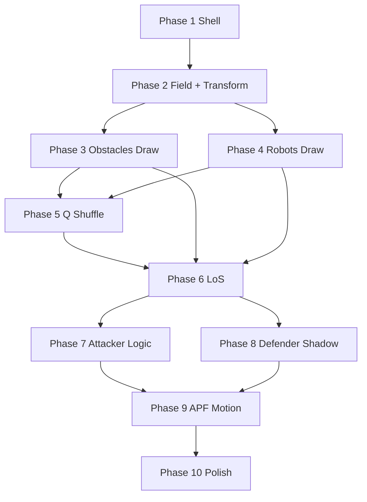

# Phased Development Plan: Autonomous Combat Robot Simulation

Aligned with [docs/development/PRD and TDD.md](docs/development/PRD and TDD.md) and [docs/agent/AI_REFERENCE.md](docs/agent/AI_REFERENCE.md). Each phase is **testable by running the app** (start DirectX_window.exe, then the simulation) and checking a short acceptance criterion.

**Q key behavior:** In this project, **Q = shuffle** (reposition robots and obstacles). Use a different key to exit (e.g. Escape or document “close window”) so Q is dedicated to shuffle.

**Libraries:** Use only the **2D graphics** library (`2D_graphics.h` + `2D_graphics_ver1.lib`). Copy those two files from `References/MECH 415 Project/MECH 415 Project/` into [src/MECH 472 Project/](src/MECH 472 Project/) if you want them at the same level; otherwise point the vcxproj include/lib paths at the References folder. No timer or ran; shuffle uses `rand()`/`srand()` from `<cstdlib>`.

**Implementation notes (current state):** Phases 1–9 are implemented. The following refinements are in place: **(1) Non-holonomic motion** — robots are differential-drive; APF yields a desired direction, chassis turns toward it, and the robot moves forward along chassis heading only (no sideways motion). **(2) Shuffle for visualization** — on Q shuffle, robots spawn at opposite corners of the field with one obstacle (Obstacles[0]) placed on the segment between them so LoS is blocked and the Defender starts in cover. **(3) Attacker when LoS blocked** — target is a waypoint to the side of the blocking obstacle (perpendicular, closer to Defender) so the Attacker navigates around rather than into the obstacle. **(4) Defender shadow** — shadow candidates are rejected if they lie inside another obstacle or too close to walls; Defender holds (target = current position) when already at shadow and LoS blocked. **(5) APF refinements** — tangential repulsion to orbit around obstacles (reduces deadlock); wall repulsion; robot–robot repulsion; capped repulsion magnitude; post-move collision check (reject move if penetrating). **(6) Two-radius collision** — `APFRadiusInches` (4") used for APF repulsion so the 12"×7" body can attempt tighter gaps; `RobotRadiusInches` (6") used for spawn and post-move collision. See [Development_Summary.md](docs/development/Development_Summary.md) for full current state.

---

## Phase 1: Minimal runnable shell

**Goal:** App builds, links, and runs one frame without crashing.

**Existing setup:** You already have the Visual Studio project at [src/MECH 472 Project/](src/MECH 472 Project/) (`MECH 472 Project.vcxproj`, `MECH 472 Project.sln`). The project currently has one source file (`MECH 472 Project.cpp` with a Hello World). Use only the **2D graphics library** you have; no timer or ran — keep dependencies minimal.

**Deliverables:**

- **Library:** Use only `2D_graphics.h` and `2D_graphics_ver1.lib`. If they are not already in the project folder, copy them from [References/MECH 415 Project/MECH 415 Project/](References/MECH 415 Project/MECH 415 Project/) into the same folder as the .vcxproj (or add an include/lib path to the References path). In the vcxproj, ensure the project links `2D_graphics_ver1.lib`. Add `winmm.lib` only if you add audio later (optional for Phase 1).
- **Project files:** In the existing vcxproj, add `sim_main.cpp` and `world.cpp` to the build (e.g. `<ClCompile Include="sim_main.cpp" />`, `<ClCompile Include="world.cpp" />`). Either remove the default `MECH 472 Project.cpp` from the build or replace its contents with the simulation loop so the entry point is the new main. Add `world.h` and `global_data.h` as needed (e.g. `<ClInclude>` or leave as referenced by sources).
- **Source:** Create `global_data.h` with `WindowWidth`, `WindowHeight` (match the DirectX window; e.g. 1344 and 500 from the reference).
- **Source:** Create `sim_main.cpp`: `#include "2D_graphics.h"`, `initialize_graphics()`, construct `world`, then loop: `clear()` → `world.Update(dt)` → `world.Draw()` → check `KEY('Q')` (no action yet) and an exit key (e.g. Escape or close window) → `update()`.
- **Source:** Create `world.h` and `world.cpp`: class `world` with empty `Update(double dt)` and `Draw()`, constructor and destructor; follow AI_REFERENCE naming (class `snake_case`, methods `PascalCase`).

**Test:** Start DirectX_window.exe, then run the simulation. Window appears and runs without crash (screen may be blank or single color). Q does nothing yet.

---

## Phase 2: Field and camera→screen transform

**Goal:** Draw a visible field and establish the PRD coordinate transform.

**Deliverables:**

- In `global_data.h`, define world bounds in **camera space** (e.g. `WorldWidth`, `WorldHeight` or use `WindowWidth`/`WindowHeight` as the logical size). PRD: top-right origin in camera space; screen transform:
  - X_{screen} = \text{WindowWidth} - X_{camera} 
  - Y_{screen} = Y_{camera}
- Add a helper (e.g. in world or a small util) that converts camera (x,y) to screen (x,y) using the above.
- In `world::Draw()`: draw the field (e.g. background color via `line()` or a full-screen quad, or a simple grid using `line()`). Use the transform for any world-space coordinates so +X camera is left on screen.

**Test:** Launch app → field is visible and orientation matches PRD (camera X increases toward the left on screen).

---

## Phase 3: Obstacles — fixed array, draw only

**Goal:** Obstacles appear as circles on the field.

**Deliverables:**

- Define an obstacle type (struct or class) with X, Y, R (radius), `isActive`; no STL — use a raw array (e.g. `obstacle* Obstacles[N_OBSTACLES_MAX]` or fixed struct array).
- In `world` constructor: allocate/initialize a fixed number of obstacles (e.g. 5–10) with positions and radii; set `isActive = true`.
- In `world::Draw()`: for each active obstacle, draw a circle using `line()` (radial loop of segments), applying the camera→screen transform before drawing.

**Test:** Launch app → see N circles at fixed positions. No movement or logic yet.

---

## Phase 4: Robots (Attacker and Defender) — draw only

**Goal:** Two robots visible with chassis and laser turret.

**Deliverables:**

- **Robot in own files:** `robot.h` and `robot.cpp` define `struct robot` (X, Y, \theta_{chassis}, \theta_{laser}, `laserOn`) and `Draw(robot const& r, world const& w, bool isAttacker)`. World owns Attacker and Defender; `world::Draw()` calls `Draw(Attacker, *this, true)` and `Draw(Defender, *this, false)`. World exposes `CameraToScreen` (public) so robot drawing can transform coordinates.
- Two robot entities: Attacker and Defender. Each has X, Y, \theta_{chassis}, \theta_{laser}, and **laserOn** (attack mode = true → draw laser; defense mode = false → laser off, no laser line). Store in `world`; no STL.
- World ctor: set initial positions and thetas; set Attacker.laserOn = true, Defender.laserOn = false.
- In `robot.cpp` `Draw()`: for each robot:
  - **Chassis:** Filled rectangle **12 in (length) × 7 in (width)** in camera space, centered at robot (X, Y), rotated by \theta_{chassis}. Draw the quad as **two triangles** using `triangle()`. Use world’s `CameraToScreen` and pixel scale (720 window = 6 ft ⇒ 10 px/inch).
  - **Turret:** A **circle** at the robot center (outline via `line()` loop); radius **at most 1/3 of body width** (e.g. 2 in). **Laser line** only when `laserOn` is true: a segment in direction \theta_{laser} extending **way beyond the body** (e.g. `LaserLineLengthInches` = 72 in) to simulate the laser. Defender does not draw the laser.

**Test:** Launch app → see two robots (Attacker with extended laser line, Defender without); chassis filled rectangles; turret circles small; orientations visible.

---

## Phase 5: Q key — shuffle robots and obstacles

**Goal:** Pressing Q repositions all active obstacles and both robots to new random positions (and optionally orientations).

**Deliverables:**

- In `sim_main.cpp`: in the main loop, when `KEY('Q')` is true, call `world.Shuffle()` (or `world::Shuffle()`). Do **not** exit on Q; keep exit on a different key (e.g. Escape).
- In `world`: use standard RNG only — call `srand()` once (e.g. in world ctor or at startup) and `rand()` in `Shuffle()`. No extra libraries (no ran.h/ran.cpp unless you manually copy them from References and prefer that RNG).
- `world::Shuffle()`:
  - For each active obstacle: set new (X,Y) within world bounds using `rand()`; avoid placing obstacles on top of each other (simple rejection or spacing).
  - For Attacker and Defender: set new (X,Y) and \theta_{chassis}, \theta_{laser} within bounds; ensure they do not spawn inside obstacles (e.g. reject if distance to any obstacle center < obstacle radius + robot radius).
- Optional: one-shot key handling so one key press triggers one shuffle (e.g. track previous frame’s Q state and only call `Shuffle()` on edge).

**Test:** Launch app → press Q several times → obstacles and both robots jump to new positions each time; no overlap (or acceptable overlap per your rules).

---

## Phase 6: Line of Sight (ray–circle)

**Goal:** LoS from Attacker to Defender is computed and visualized.

**Deliverables:**

- Implement ray–circle LoS (PRD): segment from Attacker (X_A,Y_A) to Defender (X_D,Y_D). For each active obstacle at center C, radius R: closest point Q on segment to C; if Q - C < R, LoS is blocked.
- In `world::Update(dt)`: compute LoS (e.g. store `bool los_clear`).
- In `world::Draw()`: draw a line from Attacker to Defender: **green** if LoS clear, **red** if blocked (use `line()` with two points and appropriate R,G,B).

**Test:** Launch app → shuffle with Q until you get one configuration with clear LoS (green line) and one with blocked LoS (red line). Verify by eye that red only when an obstacle lies between Attacker and Defender.

---

## Phase 7: Attacker logic — aim and target

**Goal:** Attacker’s chassis and laser aim at Defender when LoS is clear; target stored for later APF.

**Turret limit (pre-implemented):** Turret angle is limited to **0°–180°** relative to chassis, with **90° = straight forward** (chassis heading). So the laser can only aim from 90° left to 90° right of forward. When computing target aim, clamp the desired angle to this range (see `TurretHalfRangeDeg` in `global_data.h`).

**Deliverables:**

- In `world::Update(dt)`: Attacker mode:
  - Target position = Defender (X,Y).
  - If LoS clear: set Attacker’s laser aim toward Defender (already done; respect turret limit so \theta_{laser} stays within ±90° of \theta_{chassis}). Set `Target_chassis_theta` (and/or target X,Y) toward Defender for later use.
  - If LoS blocked: set target to “move around obstacle” (e.g. still Defender position; APF in Phase 9 will handle repulsion).
- Optionally: smooth or step Attacker’s \theta_{chassis} toward target for visible feedback (no full motion yet). Turret \theta_{laser} already follows Defender within limit.

**Test:** Launch app → with clear LoS, Attacker’s turret (within limit) and chassis point toward Defender; if Defender is outside turret range, turret clamps to nearest limit. After shuffle to blocked LoS, target still Defender (pathfinding in Phase 9).

---

## Phase 8: Defender logic — shadow target

**Goal:** Defender’s target is a “shadow” point behind an obstacle.

**Deliverables:**

- Implement shadow coordinate (PRD): vector \vec{V} from Attacker to obstacle center; normalize; extend by (obstacle radius + robot radius + buffer); add to obstacle center to get shadow point. Optionally choose “best” obstacle (e.g. closest shadow within bounds).
- In `world::Update(dt)`: Defender target (X,Y) = chosen shadow; set Defender’s `Target_chassis_theta` (and target position) toward that point.
- Optionally: draw a small marker at the Defender’s current target for debugging.

**Test:** Launch app → Defender’s intended target is behind an obstacle relative to Attacker; shuffle and repeat.

---

## Phase 9: APF pathfinding and motion

**Goal:** Both robots move toward their targets and avoid obstacles via APF.

**Deliverables:**

- Implement APF: attractive force toward target; repulsive forces from obstacles within a safety distance; sum forces to get desired direction (or target point). Compute from this: `Target X`, `Target Y` (and thus `Target_chassis_theta`). Use PRD formulas.
- In `world::Update(dt)`: run APF for Attacker (target = Defender or waypoint) and Defender (target = shadow); update robot positions by integrating toward target (e.g. constant speed in force direction, or move a step toward target X,Y). Update chassis and laser thetas from targets.
- Ensure obstacles use fixed arrays and `isActive` only; no new allocations in update.

**Test:** Launch app → both robots move toward their targets; they do not pass through obstacles. Press Q to shuffle and repeat; behavior remains correct.

---

## Phase 10: Polish and stability

**Goal:** Correct frame order, simple UI text, and stable behavior.

**Deliverables:**

- Enforce frame order (AI_REFERENCE): `clear()` → `World.Update(dt)` → `World.Draw()` → input (Q shuffle, exit key) → `update()`.
- Add minimal HUD with `text()`: e.g. “LoS: CLEAR / BLOCKED”, “Q = Shuffle”, “Esc = Exit”.
- Tune constants (APF gains, radii, speeds) in `global_data.h` so motion looks reasonable. Optionally add a short cooldown or one-shot for Q so shuffle does not fire every frame.

**Test:** Full run: shuffle with Q, watch Attacker hunt and Defender evade; LoS and paths correct; no crashes; exit with chosen key.

---

## Dependency overview

---

## File layout (flat, per AI_REFERENCE)

- **Entry:** `sim_main.cpp` (simulation main loop)
- **World:** `world.h`, `world.cpp`
- **Shared:** `global_data.h`
- **Graphics:** `2D_graphics.h` (read-only) + `2D_graphics_ver1.lib` — the only external library; copy to project folder if needed.
- **Assets:** `art/`, `sounds/` as needed (optional for early phases)

No STL in simulation logic; fixed-size arrays and `isActive` for obstacles and entities; world owns all and deletes in dtor. Random for shuffle: `rand()`/`srand()` from `<cstdlib>` (or optionally copy `ran.h`/`ran.cpp` from References and use that).